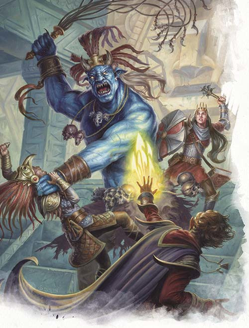

# The Hidden Shrine of Tamoachan: Part 3

Claude casts _lesser restoration_ on Badger which temporarily removes the poisoned condition and wakes him up. The restoration will only remove the effects for one hour, but Claude believes he can use the silvery dust in the crystal flask to craft a permanent antidote later. You bring Badger up to date with your adventures and his current condition.

You find nothing more in the strangely shaped room but Badger takes the jade cat statue from the altar. There are three other doors leading from the room. You entered through the door in the west wall. There are also doors to the southwest, north, and northeast. You take the northeast doors. Remy checks for traps, but finds none. The doors open into a passage that snakes northeast, then south, southwest and south and ends with a single door in the east wall. Again, Remy finds no traps.

Beyond this door is a large square room. In the center of the room is a withered tree that looks like a leafless willow, rooted in a terraced depression. The bottom of this hollow is filled with oily water, a few inches deep. Across the room, beyond the dead tree, is another door. Around the sides of the room, a five-foot-wide ledge encircles the tree. The walls of the room are beaded with condensation.

You approach the tree cautiously. Suddenly it begins to move! Long tentacles lash out to ensnare you and draw you into a mouth surrounded by sharp spines. Remy attacks, but cannot get through the tree creature's thick skin. Badger flies into a rage and attacks with his scimitar. Badger, Dioica, and Ocardo are all grabbed by tentacles. The tree reels in Badger and tries to eat him. Ocardo manages to get free. Dioica casts an _erupting earth_ spell, creating a fountain of churned earth and stone, and damaging the tree significantly.

Claude casts a _guiding bolt_ at the tree but misses. The tree grabs Claude as well. Ocardo chops through a tendril to free Badger, while Dioica uses some _alchemist's fire_ to try to burn herself free. Poon Tang throws more _alchemist's fire_ over the trunk. Still grappled, Claude hits the tree with a _guiding bolt_ and hands Badger the _obsidian-toothed sword_. Badger attacks with the magic sword; it's obsidian teeth slice through the tree creature's bark like skin. Badger cuts his way through the creature and out the other side.

With the creature defeated, you rest a while, patch your wounds, and extinguish your fires. Claude takes some time to identify some of the magic items you have already collected. The bracers are _bracers of defence_. The jade ring in the form of a man holding the moon is a _ring of fire resistance_. The jade ring in the form of a panther ready to strike is a _ring of animal influence_. The 'bracelet' is a _giant's ring of rock magic_. Poon Tang attunes to it. It grants her immunity to petrification, and allows 3 castings of _flesh to stone_. When the 3 castings are used up, it allows 13 castings of _stone shape_. The rusty dagger is a _+1 dagger_. And the battleaxe is a _+2 magic battleaxe_. Badger attunes to  and it increases his hit point maximum by his level. It also has three spells wrapped into its handle: _passwall_, _burning hands_, and _gust of wind_. It has 12 charges and regains 1d6+4 charges daily at dawn. Casting takes charges equal to the level of the spell.

After your short rest, you check for traps and continue through the east door. It opens into a passage leading south. You follow until it opens into an enormous chamber, thirty feet tall, with mighty buttressing and a vaulted ceiling. Parts of the ceiling and walls have collapsed, and raw earth has spilled down from a gaping hole in the east wall. Crushed beneath a fallen block in the center of the room are humanoid remains. Elsewhere around the floor are the chewed and decayed corpses of baboons. Through a hole in the eastern ceiling, daylight and fresh air filter in. Above, through this gap, can be seen four baboons. They jump around the hole and and scream in agitation, and as they do, dirt begins to slide down the banks and rocks in the walls shift slightly.

You cautiously cross the chamber. The exit on the other side is a set of double bronze doors in the north wall. Above them is a plaque inlaid with jade depicting a two-headed serpent, with the second head where its tail should be. As you check this door for traps, a giant two headed snake tries to sneak up on you through the rubble.

Poon Tang uses her giant magic ring to attempt to turn the creature to stone. Unfortunately, the magic fails to effect the creature. Dioica stabs at it with her spear. Claude attacks with his magic rapier, but misses. Ocardo hits it with an _eldritch blast_. And badger hits it with his scimitar although he finds his mind drawn to his axe and can't properly concentrate on his attacks. Remy also misses his attack and it looks like the snake is going to get him but he uses his _second chance_ to avoid the attack. The other head attacks Claude, but misses as well.

Poon Tang tries again with the giant magic ring, but it fails again. Dioica transforms herself into a bear and battles one head while Claude skewers the other with his rapier. However, with the giant two headed snake defeated, the baboons now climb down into the chamber and start throwing rocks at you. Dioica casts _animal friendship_ to calm the baboons.

You investigate the fallen blocks in the center of the room. Badger uses his _aspect of the bear_ to gain extra strength and heave the block off of the crushed human remains. You find a pouch containing 40 electrum pieces, a broach of bronze and green quartz in the shape of a lizard, a silver and beryl-emerald ring, a silvery dagger, and a scroll case. The scroll case contains a map of the territory that the ruins are located within. A search of the area also turns up a cracked 3 inch crystal sphere.

Using a combination of Ocardo's _misty step_, Remy's magic whistle, Dioica's shape changing, and help from the baboons, you manage to climb out through the hole in the roof of the chamber and make a camp on the outside of the temple. You take a long rest to heal and identify your other finds. The powder in the glazed clay container stopped with flower-shaped plugs is the dried out remains of a _potion of invisibility_. The red liquid in the bottle you found at the feet of the corpse in the first tomb is an _elixir of health_. The pendants made of silver and turquoise are each an _amulet of protection from turning_. Ocardo contacts Terry and is advised to check the body of the tree creature. You also notice that Bobolink is missing.

After you have rested and reawakened Badger, you go back into the temple ruins to examine the tree creature's corpse. Cutting into it, you find 12 pieces of blue jasper and a silvery rod. Claude identifies the rod as a _wand of lightning bolts_.

You return to the cave-in chamber and try the west door. It leads into a room covered with a layer of fine gray dust and ash three inches deep. Across the room, opposite where you entered, is another set of double doors. There are two empty alcoves to the north and south. On small ledges in each corner of the room are pieces of what appear to be broken pottery.

Remy flies across the room, and as he does so, sends motes of dust and ash swirling into the air, and these clouds form into shapes.

First, from the ash, a dusty phantom assumes the shape of a woman. Her face is forlorn and tear-streaked. She throws up her hands in despair, rushes into one of the alcoves, and disappears.

Immediately afterwards, two more dusty phantoms emerge — mighty warriors armed with jagged-edged swords and bearing fierce countenances. They move to block the doorway opposite where you entered.

You attempt to attack the phantoms but they collapse and dissipate at the merest touch. They act in a threatening manner but they are unable to harm you. After searching for secrets and loot you continue on and find yourself back in the cat room, this time through the south west door. However, there is something different about it... the cat-man statue has gone.

As you carefully search the room, Poon Tang is suddenly attacked by a jaguar. Remy manages to hit the creature and Dioica uses almost all of the charges in the _wand of lightning bolts_. Nonetheless it still takes additional hits from Remy and an _eldritch blast_ from Ocardo to stop it. The last hit from Ocardo turns the creature back to stone.

Searching the room again, you find a secret door concealed in the mouth of the wall carving. The catch to open it is in the hollow of the right eye. Beyond, is a passage, the walls of which glow magenta, bathing the corridor with a ghastly hue. After fifteen feet, the floor drops away to a pit that fills the hallway ahead. The pit is twenty-five feet deep. Eight large, spidery bushes with thorny stems, white leaves, and enormous yellow blossoms grow across its bottom.

Five feet beyond the nearest edge of the pit is a bronze bar, set level with the floor and embedded in the pit walls to either side. Farther out over the pit can be seen other similar bronze rungs, set at five-foot intervals. On the floor by the edge of the pit is a scattering of broken, rotting wooden planks.

The bushes in the pit sling thorns at anyone looking over. Badger sets fire to the bushes and then searches the area once the danger is gone. Unfortunately, you find nothing valuable here for your trouble.

You take the final door from the cat room to the north. A passage leads toward a set of double bronze doors bearing the engraved face of the jaguar god. Both walls of the corridor are carved to represent two lines of warriors in profile, holding hatchet-headed pole-arms and facing the western doors. These figures are painted with vivid, lifelike colors: red, black, white, green, and yellow. Remy doesn't see any traps here, so Ocardo moves towards the door. But unfortunately there is a pressure plate at the mid-point of this corridor. Two carved warriors pivot out from the walls in front of you, crossing their metal halberds to bar your way. The blades spark and hum as they are brought together. Ocardo attempts to crawl under but he touches a blade and is electrocuted. Thinking quickly, Remy uses his _mage hand_ to move Ocardo out of contact with the blades. He then disarms the trap while Badger crawls under.

When the door opens, a rush of warm, foetid air greets you. The room is lit with a sanguine glow. On the wall opposite the door are tacked several human skins. A cat-o’-nine-tails hangs beside them.

To the west the room widens to accommodate a statue that towers almost to the ceiling. The statue is an ogre-like figure, outfitted in flayed skins and adorned with skulls, with a gaping mouth wide enough to swallow a horse whole. It is seated atop a huge basin of red-hot coals, more than ten feet in diameter.

Around the statue is a pile of splintered bones, skulls with cracked pates, and broken weapons. In front of the display crouches a panther, deathly still, facing away from the statue.

To the east the walls are highly polished. They loosely enclose an intricately carved well that seems to be illuminated from within. Beyond the well, mounted on the wall, is a blackened mirror with a richly ornamented frame. Directly above the well, in the twenty-five-foot-high ceiling, a five-foot-wide opening can be discerned in the red light of the room.

As you approach the statue, the panther stands and pads menacingly in your direction but then continues past appearing not to notice you. "It's that prick Bobolink!" says Remy. Claude detects that the mirror is not magical while Badger begins a ritual to allow him to talk with the panther and Ocardo searches around the statue. Ocardo finds a broken mace head. The head is good but it will need a new handle to be useful. Dioica climbs down into the well to find the source of the light. As soon as she does, a brilliant light flashes upward and a bellowing voice fills the chamber. The voice is speaking in the giant language.

Dioica climbs out of the well. She has some oily light on her hand. The light is slowly spreading over her body. She isn't able to wipe it off. Claude casts _tongues_ on Dioica. She understands it to be saying "Who disturbs the great Xipe and for what purpose?" Dioica says they bring gifts. She shape changes into and snake and then sheds her skin before returning to her normal form. The oily light remains on the shed skin.

Remy uses the magic whistle to fly up above the well into the chamber above carrying a rope. Ocardo uses a _misty step_ to get up there. Dioica climbs up. Beyond the hole in the ceiling is a chamber that measures 30 feet in each direction. There is a giant blue creature in the chamber. He casts _fear_ at the group with a bellow that shakes the room.

Dioica is effected by the fear and makes a run for it. Poon Tang climbs up. She attempts to use the rock magic ring for the final time. It doesn't work. THe ring can now cast _stone shape_ up to 13 times. Remy and Ocardo both attack Xipe, and Xipe attacks Ocardo and then casts _sleep_ on the party but it fails. Meanwhile, Dioica shakes off the fear spell and climbs back up the rope. She uses the last charge on the _wand of lightning bolts_ to hit Xipe and kill him. Ocardo drains his life force as he dies.

In Xipe's room you find a wooden cylinder, eight cat furs, two leather bags, and an intricately carved ivory cube. The cylinder contains a spell scroll and the bags each contain a thousand silver pieces. Remy examines the ivory cube to see if there is a way to open it. To open it, he pushes in two plugs on either side of the cube, and then slides the center out of the frame formed by the other four sides. This inner box opens like a chest. And within it is a silver and aquamarine necklace and a parchment packet holding three pinches of dust. Claude identifies the spell scroll as a spell scroll of _detect magic_, the dust is _dust of disappearance_, and the mace head is the head of a _+1 mace_.

Badger finishes his ritual with the panther. He attempts to communicate with the creature but finds he cannot. It is a real animal, and it can clearly see and hear fine, but it just doesn't register the existence of humanoids. Badger decides to leave the panther to guard its statue in peace. Next you decide to go back to the cat room and check out the calendar stone.

The calendar stone conceals a secret entrance to a narrow tunnel that slants down and away. The passage is barely four feet in diameter, and the walls are carved with a profusion of ancient and weird glyphs. The floor of the tunnel is slick with a molten, glassy glaze. The tunnel opens out two feet above the floor of a corridor running north and south. Three exits are visible, one at either end of the hallway and a set of double doors on the midpoint of the western wall.

The door to the north is barred, though it seems to have no latch. The image of a bear holding a disk of obsidian is set in its face. The lintel of the door is carved in the form of entwined serpents.

The southern door is plated in bronze. Etched on it is a symbol of two circles joined. The path leading up to it has a depression in the stone floor, as though it has been worn smooth by the passage of countless feet.

The floor in front of the central doorway is sunken and glazed. Affixed across the double doors is a golden seal one foot in diameter with ancient glyphs scribed into it. To open this door, it appears that the golden seal must be broken. Ancient glyphs are scribed on the seal. To either side on the lintel of the door are barely discernible scratches, and brown stains stipple the wall and floor.

You discover that the door to the north is a fake and a trap although it appears to be non-lethal. The door to the south is stuck. Badger decides to force it and ends up falling into a small room and disappears. Ocardo follows him in.

The rest of you debate whether to follow. Although none of you can read Olman, Claude thinks the message is a warning of some kind and talks of death. You think the brown stains may be dried blood. Remy checks for traps on the door, but it seems to be clear. Nevertheless he uses a mage hand to break the seal. Dioica decides to open the doors. The doors are not trapped, however, opening them triggers five heavy crossbows set in the ceiling of the room beyond and Dioica is peppered with crossbow bolts. Somehow, she survives and Claude provides some healing.

Beyond the door is a pillared porch overlooking a chamber that contains a model of a city. Arrayed on the porch are numerous clay statues of guards holding bronze-headed spears. The face of each statue is different, as if they were modelled from different subjects. Next to each statue is a small, glazed clay pot. The walls are decorated with brightly coloured frescoes depicting a royal court in ceremonial garb and a king arrayed with his armies.

There is a chill in the chamber beyond, like that of a brisk winter morning. In the center of the room is an enormous, tarnished copper raft, crafted to resemble a dragon, bearing a copper coffin. The raft is afloat on a sea of silvery-white, flowing metal, fed by several rivers that trail along the floor of the room. The flowing liquid appears to be cool.

Between the waterways, stepped pyramid-temples rise skyward in mute paean to the gods of ancient Olman. Three of the pyramids appear to have tops that can be removed. In the rest of the area, a royal complex sprawls across verdant fields, and courtyards and ringed marketplaces dot the miniature countryside. There is a blight on this spectacle, however, for several of the models have been smashed and melted.

You decide to find Ocardo and Badger before attempting to tackle this room you each go disappear through the south door. You emerge in familiar surroundings and rejoin Badger and Ocardo. You are back at the long hall with the sun painting. You decide to return to the woman in the water. Remy is convinced that she is a vampire. Poon Tang attempts to assassinate her with an arrow dipped in holy water. She hits, but the creature does not appear effected by the holy water. Dioica jumps into the pool and transforms herself into a shark and attacks the woman. Remy keeps his bow trained on her.

The woman calls on the "water god" to protect her. The waters begin to heave and boil and the watery form of a giant humanoid with an elephantine head, wearing an elaborate headdress and holding a trident, rises up. It levels its trident at Remy. Remy fires an arrow at the creature as it unleashes a lightning bolt at him. Remy is hit and stunned. Then a great wave sweeps Remy and Badger into the water. But the water god is an illusion. Behind the illusion is a giant lightning eel. Badger manages to kill the eel, but the woman ducks below the water and becomes invisible. Ocardo decides to use himself as bait and jumps in. She tries to drown him by creating a whirlpool and giving him a drowning kiss, but his _hellish rebuke_ defeats her.

At the deepest part of the pool is a grotto hidden behind a bed of kelp. In this cave are six golden statuettes and a golden mask. Also lying in the cache are two crystal scroll cases, a silver idol, and a pair of gloves. The scroll cases once contained scrolls but the water has destroyed them. The silver idol is actually a bottle containing a potion which Claude identifies as a _potion of clairvoyance_. And the gloves are _gloves of missile snaring_.