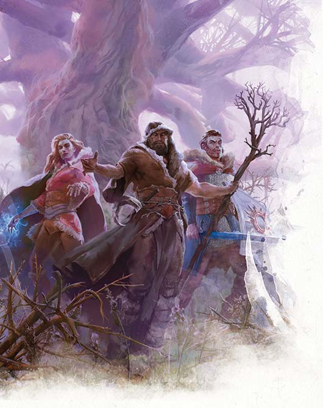

# The Sunless Citadel: Part 4

Pom-Pom is revived. She wakes with Ocardo's blade at her throat. Her attempts to explain herself convince nobody but Princess. Ocardo rummages through her backpack and finds a fiendish contract. From this they find out her real name is Poon Tang, and she is a criminal working for Princess' father. She has been infected with lycanthropy and bound to the protection of Princess.

Ocardo carefully examines the infernal contract and detects an applicable loophole. The contract is worded to bind Poon Tang to the protection of Princess for as long as she is able. However, since the banshee's wail left her helpless, the contract was honoured and Ocardo is able to terminate it.

When the penny finally drops for Princess she flounces out of the citadel to return to Neverwinter and confront her father, taking Tree Trunks with her. Meanwhile, the rest of the party agree to keep Poon Tang in the party, although under careful watch. They take a long rest to recover their strength. Claude dissects the green demon and takes its eyes, teeth, claws, and heart as samples for further study.

When they return to the kobold held territory of the citadel, much has changed. Calcryx is now fully ensconced as leader in a crude facsimile of a royal court; complete with Meepo as court jester. Yusdrayl is no longer anywhere to be seen. The kobolds are jubilant and have spread throughout the upper floor of the citadel. And the party are treated as conquering heroes by the kobolds for returning their dragon and driving out the goblins. They are showered with praise and tributes.

The party then make their way back to the goblin chief's room where the shaft of a collapsed stairwell leads down to a lower level. Luminous fungi growing below light the area in a dim violet. The party fix ropes at the top of the shaft and lower themselves into the cavernous room below. Here there are two animated skeletons tending a couple of saplings with shovels and a rusty wheelbarrow. As soon as the party touch the ground, the saplings come to life and attack, closely follow by the skeleton gardeners.

From above, Ocardo obliterates the nearest twig blight with an eldritch blast while Bobolink conjures a chromatic orb at a skeleton attacking Dioica. On the ground, Dioica and Badger make short work of the gardeners as the rest of the party descend. However, with one threat eliminated another soon takes its place. A large hairy goblin creature emerges from a cave entrance to the north, wearing a crown of antlers and flanked by two giant rats. It shouts something in goblin, which Badger translates as "get ready to meet the cook pot!" This is Balsag the bugbear.

Bobolink turns himself invisible, Ocardo and Claude blast the bugbear with magic, while Remy delivers the kill shot. Meanwhile Dioica uses her magic to take control of the two rats. As the party collect themselves, Bobolink invisibly searches the bugbear's lair. He hears goblins retreating through tunnels in the dark depths of the cave and finds many weapons and a large cloak of patchy black fur but he decides to leave them.

Outside, on Balsag's corpse, the party find a potion of healing. Bobolink returns and then decides to press on through a door in the northeast. Beyond is a hall with three chambers on each side. He can hear goblins chattering and toiling. He lets the rest of the party know, before returning to explore further while still invisible. The others charge into the hall to take on the goblins, except Claude who remains to guard the other doorway to the south.

Dioica transforms herself into a hyena for this battle. The party make short work of the goblin workers and begin to explore the area. One room is a goblin dorm room, another is where the goblins have been making a wine of some description. Meanwhile, badger revives one of the dying goblins and intimidates him in an attempt to learn the whereabouts of Sharwyn. The goblin says only that Belak would know. Meanwhile, Bobolink finds that the last room has a door leading into another large garden. This garden contains another bugbear who is busy gardening. He hurries back to get the others. But by the time the party have gathered themselves and followed Bobolink back into the garden, the bugbear has gone.

At this point, Claude decides to go through the door to the south and explore further. Beyond this door he finds a dark corridor leading south. He uses his magic to light the way and finds a shallow rift cutting through the passage. The passage continues beyond the rift but shifted to the right. He decides to navigate past the rift and continue south. Eventually he finds a long forgotten chamber containing a dragon statue. Unfortunately, its contents have long since been removed.

Meanwhile in the garden, the party are attacked by the bugbear gardener and another group of Durbuluk goblins. The battle is short and the party easily defeat them. Ocardo uses his hexblade curse to draw energy from the death of the last goblin. They continue to explore the doorways leading out of the garden. The room holding the goblins and the bugbear is empty apart from a wide variety of mushrooms and fungi. The other room is also empty but contains some mysterious round holes in the floor.

On his way to rejoin the party, Claude stops to examine the rift more closely. It also contains many perfectly round holes. The holes are deep and there is a faint smell of burned earth around them. Curiosity gets the better of him and Claude follows the holes to a cavern where a dim fiery glow shines from one of the holes. He has a quick peek in and disturbs a fire snake.

Fortunately, Claude avoids the snake's attacks and manages to take it down with a guiding bolt. He then sets about finding a way to take the corpse as a trophy to show the rest of the party. However they have their own fire snake to deal with. Dioica turns herself into a spider and senses the creature without alerting it. With some idea of what they are up against, the party then provoke the fire snake into leaving its nest and kill it. In the nest they find two sapphires. Remy appraises the gems to be worth around 50 gold pieces each. So when Claude shows up with a fire snake skewered on one of Balsag's spears the rest of the party are less surprised than he was expecting. Remy and Claude go back to search the other fire snake nest for more gems while the remainder of the party continue to explore the gardens.

The northern half of the garden is symmetrical with the south. After clearing out the area of a few more skeletons and twig blights, the party regroup with Claude and Remy who have indeed found two more sapphires hidden in the other fire snake nest. A small door leading out of the last chamber takes them to a shrine to Ashardalon the dragon. Here granite blocks line the walls and ceiling, carved with dragon motifs. Many of the blocks have broken away and debris litters the floor. A huge marble statue of a rearing red dragon dominates the room, its empty eye sockets producing a faint red glow which is the only illumination in the room. An inscription is carved around the edge of a dark stone on the floor in front of the statue. The inscription is in draconic, which Dioica interprets as "let the sorcerous power illuminate my spirit."

The party try various spells and Remy tries putting gems in the eye sockets, but nothing seems to happen. The rest of the party continue onward in the hope of find some clue while Dioica remains and recites the inscription in draconic while standing on the stone in front of the statue. A puff of spectral flame belches from the dragon's mouth and envelopes Dioica, illuminating her spirit and granting her an air of authority. Unfortunately, this also releases a shadow which immediately attacks the druid where she stands.

Although ordinary weapons are somewhat ineffective against this creature, the party manages to destroy it, before it can drain them of their strength.

The adjacent room is a ruined library. Among the books and scattered papers, the party manage to find two spell scrolls: Scorching Ray, and Melf's Acid Arrow. Remy also finds the book on dragon lore that he had come for.

The way on leads through an underpass under the garden and into a passage leading south. There is a locked door here which Bobolink opens with a knock spell. Inside is a messy study. On scattered notes, the party learn the details of some of Belak's experiments carried out over the last decade. While the rest of the party are searching these notes, Bobolink opens a further door and alerts some goblins guarding a gate beyond.

Bobolink casts colour spray to blind the goblins, Poon Tang transforms into a wolf, and the party attack. The goblins call out "aid us, protectors of Twilight Grove!" And the twig blights, that form much of the grove beyond, come to their aid. The grove itself is lit with a pale light and full of thorny briers which press close and cast twisted shadows everywhere. In the distance a huge tree dominates the scene surrounded by the crumbling walls of the citadel. The party fight their way through to the tree. There they find Belak the outcast, Sir Bradford, and Sharwyn Hucrele. The young humans have black eyes and grey skin with the texture of bark.

Dioica addresses Belak, reading out his crimes against nature. But Belak cries out, "hold a moment, you know not what you do!" while casting a barkskin spell on himself. He then casts a flaming sphere into the middle of the party and Sharwyn uses her magic to put Dioica to sleep. Sir Bradford engages Ocardo in combat, while Remy wakes Dioica. She suspects that the tree is the source of Belak's power over the young humans and suggests that Remy attempts to destroy it. Bobolink and Erky hide, while Claude is set upon by twig blights. Poon Tang pounces on Belak but the druid defends himself with his magic shillelagh, a weapon imbued with magic that can harm her. Sharwyn then blinds Ocardo, Poon Tang, and Dioica with a dazzling array of coloured lights.

Ocardo teleports himself out of trouble and takes the fight directly to Belak. However, in the branches above him, Kulket, Belak's giant frog companion has been hiding and ready to pounce. But Kulket has picked the wrong target: the moment he bites into the warlock, he is surrounded with flame. Such is the ferocity of the Ocardo's hellish rebuke, that the giant frog is consumed by the flames.

Belak fights on against the still blinded Ocardo and Poon Tang while badger manages to knock out Sharwyn. Remy continues to try to destroy the tree with his weapons, but they aren't having much effect. Claude and the blinded Dioica are attacked by more twig blights.

Badger then knocks out Sir Bradford and sets the Gulthias tree on fire. With his sight returning, Ocardo grabs Shatterspike, Sir Bradford's magic weapon, and uses it on Belak's shillelagh. The magic of the sword shatters the druid's staff and leaves him defenceless and defeated.

The party gather themselves as the Gulthias tree burns. It's power over Sir Bradford and Sharwyn is broken but their lives are still tied to it. From Belak they learn that once it is dead, they will surely perish too. But Dioica thinks there may yet be hope and directs Badger to cut into the heart of the tree. As sap bleeds out, one last blood red fruit is formed. Badger forces the magic fruit into Sharwyn's mouth and she is magically revived and restored to human form. Meanwhile Ocardo uses Shatterspike to release Sir Bradford from his curse the hard way.
